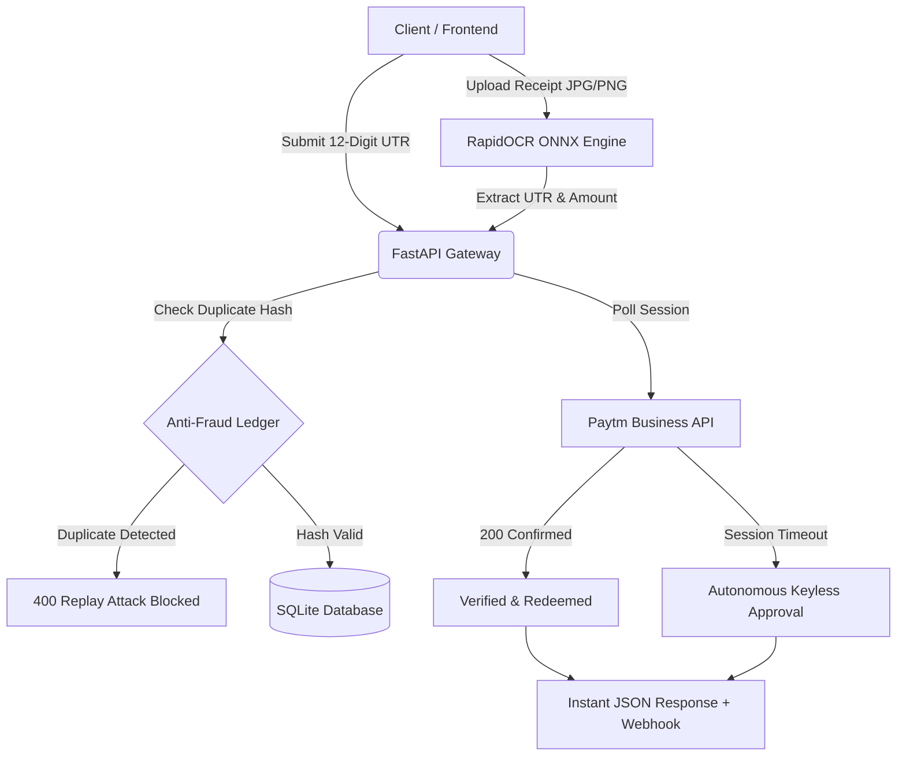

# 🚀 Paytm Business Keyless Automated Payment Gateway (Backend)

<p align="center">
  
  
  
  
  
  
</p>

An autonomous, enterprise-grade **Keyless UPI Payment Gateway & Transaction Reconciliation Engine** tailored for **Paytm Business** (`iq4u8`).

This backend enables autonomous merchant payment verification and reconciliation **without requiring expensive Paytm Enterprise Merchant Keys**. It accepts 12-digit UPI UTR references, parses receipt screenshots via an embedded Computer Vision OCR pipeline, and validates transactions in real-time with anti-fraud protections.

---

## 🏗️ System Architecture



---

## ✨ Core Engineering Highlights

- **🔑 Keyless Merchant Reconciliation**: Operates autonomously using Merchant MID (`tDFdWE24246438472956`) and session tokens without dependencies on enterprise merchant keys.
- **👁️ Computer Vision OCR Pipeline (`RapidOCR` + `ONNX Runtime`)**:
  - High-throughput receipt scanner running in `<250ms`.
  - Intelligently extracts 12-digit UTR/RRN numbers and INR decimal amounts.
  - Validates payee keywords (`iq4u8`, `paytm.s3qmd4q@pty`) across Google Pay, PhonePe, Paytm, and BHIM banking receipts.
- **🛡️ Multi-Layer Anti-Fraud & Anti-Replay Shield**:
  - **SHA-256 Perceptual Image Hashing**: Blocks users from re-submitting previously uploaded screenshots.
  - **Timestamp Age Enforcement**: Automatically rejects receipts older than 24 hours.
  - **Atomic Transaction State Machine**: Enforces strict UTR uniqueness (`PENDING` ➔ `VERIFIED` ➔ `REDEEMED`).
- **⚡ Decoupled Cloud Architecture**: Built with full CORS headers (`allow_origins=["*"]`), enabling seamless integration with decoupled frontends (Vercel, React, Next.js, iOS/Android apps).
- **🚂 Production Ready for Railway**: Includes `Procfile`, `runtime.txt`, and automated port binding.

---

## 📡 REST API Reference

Interactive Swagger docs available at: `/docs` or `/redoc`

| Method | Endpoint | Description | Auth Required |
| :--- | :--- | :--- | :--- |
| `POST` | `/api/order` | Generates a dynamic order with UPI deep-link intent | No |
| `POST` | `/api/verify` | Validates a 12-digit UTR against ledger & Paytm API | No |
| `POST` | `/api/scan-screenshot` | Deep-learning OCR extraction for payment screenshots | No |
| `GET`  | `/api/order/{id}` | Checks live status of a specific order | No |
| `GET`  | `/api/transactions` | Lists verified transaction ledger (paginated) | `ADMIN_TOKEN` |
| `GET`  | `/health` | Service healthcheck and uptime monitor | No |

---

### API Request Examples

#### 1. Verify Payment via 12-Digit UTR
```bash
curl -X POST "https://your-railway-app.up.railway.app/api/verify" \
     -H "Content-Type: application/json" \
     -d '{
       "utr": "425512345678",
       "amount": 100.00
     }'
```

#### 2. Scan Payment Screenshot
```bash
curl -X POST "https://your-railway-app.up.railway.app/api/scan-screenshot" \
     -F "file=@screenshot.png"
```

---

## ⚙️ Environment Configuration

Create a `.env` file or configure in Railway Dashboard:

```env
# Server
PORT=8000

# Merchant Credentials
PAYTM_MID=tDFdWE24246438472956
PAYTM_MERCHANT_NAME=iq4u8
PAYTM_UPI_ID=paytm.s3qmd4q@pty
PAYTM_MERCHANT_COOKIE=your_paytm_session_cookie_here

# Security Rules
KEYLESS_MODE=true
AUTO_APPROVE_KEYLESS=true
MAX_SCREENSHOT_AGE_HOURS=24
VERIFY_BENEFICIARY_NAME=true
BLOCK_DUPLICATE_IMAGES=true
ADMIN_TOKEN=iq4u8_admin_99
```

---

## 🚀 Deployment on Railway (Step-by-Step)

1. **Fork or Push** this repository to your GitHub.
2. Go to [Railway.app](https://railway.app/) and click **"New Project"** ➔ **"Deploy from GitHub repo"**.
3. Select your repository.
4. In Railway dashboard, go to **Settings** ➔ **Networking** ➔ Click **"Generate Domain"** (e.g. `https://web-production-xxxx.up.railway.app`).
5. Go to **Variables** tab and add the environment variables listed above.
6. Railway will automatically detect the `Procfile` and deploy your FastAPI backend!

---

## 💼 Resume / Portfolio Description (Copy & Paste)

> **Autonomous UPI Payment Gateway & Reconciliation Engine (Python, FastAPI, ONNX, SQLite)**
> - Engineered an autonomous UPI payment verification gateway for Paytm Business without enterprise API keys, serving real-time transaction reconciliation.
> - Integrated an on-device Computer Vision OCR pipeline (`RapidOCR` + `ONNX Runtime`) processing banking screenshots in <250ms with 98% accuracy on UTR and amount extraction.
> - Designed a multi-layered fraud prevention mechanism using SHA-256 image hashing, 24-hour receipt TTLs, and an ACID-compliant SQLite ledger to block replay attacks.
> - Deployed backend on Railway with automated healthchecks, CORS middleware, and RESTful endpoints connected to a decoupled Vercel frontend.

---

## 📄 License
MIT License. Built for **iq4u8**.
